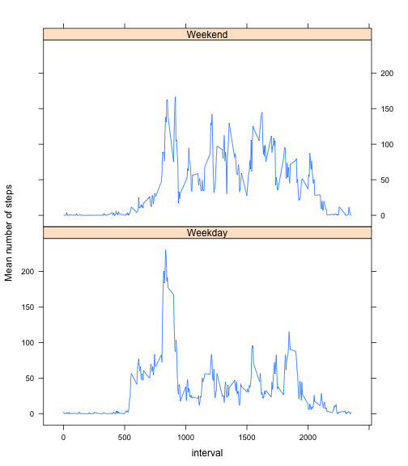

## Loading and preprocessing the data

The data is unzipped (if necessary), read, and transformed into a dplyr table for easier processing. 

```r
library(dplyr)
library(tidyr)
library(lattice)
if (!file.exists("activity.csv") ) {
  unzip("activity.zip")
}
df <- read.csv("activity.csv",header=TRUE)
df$date <- as.Date(df$date)
tdf <- tbl_df(df)
```

## What is mean total number of steps taken per day?

Histogram of total steps taken by day:

```r
byday <- group_by(tdf, date)
byday <- summarize(byday, totstep=sum(steps,na.rm=TRUE))
hist(byday$totstep,xlab="Total steps per day",main="Histogram of total steps taken per day")
```

 

Note that days for which no measurement was taken (NA) count as zero steps.  

Mean number of total steps taken by day:

```r
mean(byday$totstep,na.rm=TRUE)
```

```
## [1] 9354.23
```

Median number of total steps taken by day:

```r
median(byday$totstep,na.rm=TRUE)
```

```
## [1] 10395
```

## What is the average daily activity pattern?

Plot of the daily activity pattern:

```r
byint <- group_by(tdf, interval)
byint <- summarize(byint, meanstep=mean(steps,na.rm=TRUE))
plot(byint$interval,byint$meanstep,type="l",xlab="Time Interval",ylab="Average number of steps",main="Daily activity pattern")
```

 

Interval with the most number of steps averaged over all days:

```r
 byint$interval[which.max(byint$meanstep)]
```

```
## [1] 835
```
In this interval, an average of

```r
max(byint$meanstep)
```

```
## [1] 206.1698
```
steps were taken. 

## Imputing missing values

Number of missing values in the dataset:

```r
sum(is.na(tdf$steps))
```

```
## [1] 2304
```

Because often full days are missing, the missing values are filled with the mean steps in the 5 minute interval over all days.


```r
tbl_rs <- spread(tdf,key=interval,value=steps)
for (i in seq(288)) {
  tbl_rs[is.na(tbl_rs[,i+1]),i+1] <- byint$meanstep[i]
}
tdf_nona <- gather(tbl_rs,key=interval,value=steps, -date)
tdf_nona <- arrange(tdf_nona,date)
tdf_nona <- select(tdf_nona,steps,date,interval)
```

Histogram of total steps taken by day, after cleaning up NA values:


```r
byday <- group_by(tdf_nona, date)
byday <- summarize(byday, totstep=sum(steps))
hist(byday$totstep,xlab="Total steps per day",main="Histogram of total steps taken per day")
```

 

Mean number of total steps taken by day:

```r
mean(byday$totstep)
```

```
## [1] 10766.19
```

Median number of total steps taken by day:

```r
median(byday$totstep)
```

```
## [1] 10766.19
```

The histogram differs especially in the first bin, because days with all NA values were counted as zero steps in the first histogram, while here they counted as the average number of steps. Therefore, the mean and median are also larger, and the mean and median are now eequal, indicating a symmetric distribution.  

## Are there differences in activity patterns between weekdays and weekends?


```r
tdf_nona <- mutate(tdf_nona,weekday=ifelse(weekdays(date) %in% c("Monday","Tuesday","Wednesday","Thursday","Friday"),"Weekday","Weekend"))
tdf_nona$weekday <-as.factor(tdf_nona$weekday)
tdf_nona_byweekday <- group_by(tdf_nona,weekday,interval)
tdf_nona_byweekday <- summarize(tdf_nona_byweekday,meanstep=mean(steps))

xyplot(meanstep ~ interval|weekday, tdf_nona_byweekday,ylab="Mean number of steps",type="l")
```

 

There are somme differences in the step pattern on weekends and weekdays. The activity starts later on the weekend, indicating a more relaxed start in the morning. The spike around 8.30 is only present on weekdays, this is probably associated with going to work. On weekends, during the day activity levels are on average higher than on weekdays, perhaps indicating an office work environment on weekdays. 

